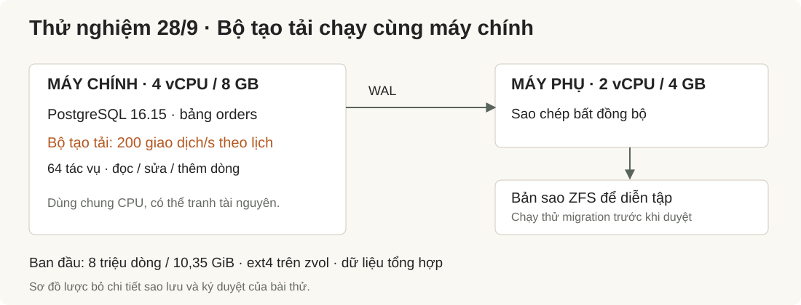
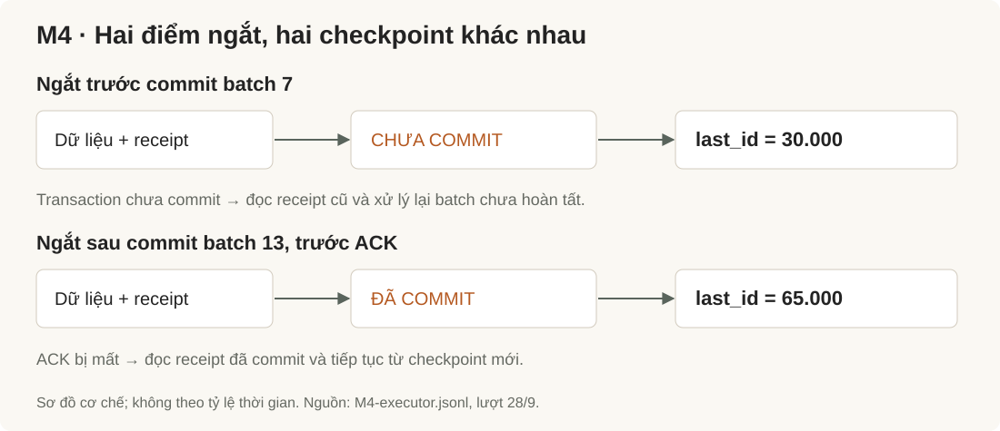
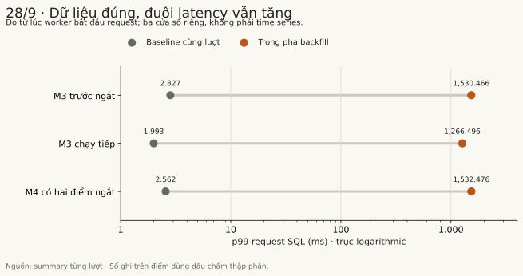
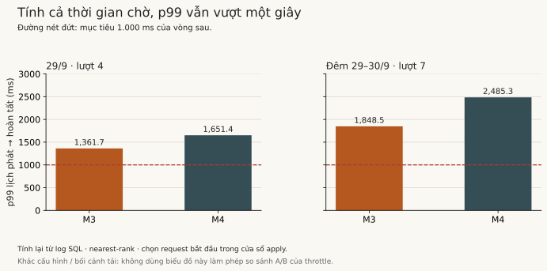

# Backfill 8 triệu dòng: dữ liệu đúng, nhưng latency không đạt

*Embra Engineering · Xuất bản 08/10/2026 · Thử nghiệm 28–30/09/2026.*

Trong lượt thử ngày 28/9, cả **846.642 lần ghi đã nhận ACK (phản hồi thành công)** đều được tìm thấy khi đối chiếu cuối lượt thử. Hai ca backfill hoàn tất, kể cả ca bị ngắt trước commit và sau commit nhưng chưa trả ACK. Các trường dữ liệu được kiểm tra không có sai lệch.

Tuy vậy, p99 của request SQL trong các pha backfill lên khoảng **1,27–1,53 giây**, từ baseline khoảng 2–3 ms. Theo ngưỡng đã đặt cho lượt thử, phần hiệu năng không đạt.

Một migration có thể cập nhật đúng từng dòng mà vẫn khiến ứng dụng chậm đến mức không nên triển khai. Bài này kể cách thử hai điều đó, một lỗi trong runner khiến bài thử phải tiếp tục giữa chừng, và vì sao thêm cơ chế điều tốc ở vòng sau vẫn chưa đủ để kết luận thành công.

Đây là thử nghiệm hạ tầng của Embra với dữ liệu tổng hợp, chưa phải kết quả trên ứng dụng khách hàng hoặc cam kết của dịch vụ hosting.

## Cần biết điều gì trước khi cho migration chạy?

Một bảng `orders` có tám triệu dòng cần thêm dữ liệu cho phiên bản app mới. Trong lúc backfill, workload tiếp tục đọc, cập nhật và tạo đơn. Hai câu hỏi phải được trả lời riêng: dữ liệu cuối cùng có đúng không, và các request đang phục vụ bị ảnh hưởng bao nhiêu?

Backfill ở đây là điền giá trị vào cột mới cho những dòng đã tồn tại. Trong fixture, phép biến đổi dựa trên `id`, không phụ thuộc trường `amount` mà workload đang cập nhật. Điều đó làm phép đối chiếu rõ ràng hơn, đồng thời giới hạn kết luận: bài thử chưa kiểm mọi phép biến đổi có phụ thuộc dữ liệu đang đổi.

Luồng lab bắt đầu bằng diễn tập trên clone lấy từ replica. Sau khi có kết quả, một approval được ký cho kế hoạch cụ thể; executor kiểm điều kiện rồi mới áp dụng lên primary. Bài thử còn có các ca thêm cột, transaction dài giữ bảng và tạo index. Phần được phân tích sâu ở đây là backfill M3 và backfill có ngắt M4.

## Cấu hình nhỏ, tải chạm đúng bảng đang đổi

*Hình 1. Cấu hình của lượt 28/9. Generator dùng chung CPU với primary; replica nhỏ hơn primary. Đây là hai giới hạn của phép đo, cần giữ khi diễn giải kết quả.*

Primary có 4 vCPU và 8 GB RAM; replica có 2 vCPU và 4 GB RAM. PostgreSQL 16.15 chạy trên ext4 đặt trong ZFS zvol. `fsync`, `full_page_writes` và `synchronous_commit` đều bật. Replica nhận dữ liệu bất đồng bộ. Database lúc seed khoảng 10,35 GiB.

Workload được lên lịch ở mức 200 transaction mỗi giây, chia đều đọc, cập nhật và insert vào chính bảng đang migrate. Generator có 64 worker và giới hạn 1.024 request đang chờ hoặc chạy. Payload mỗi dòng là dữ liệu tổng hợp có tính nén; đây chưa phải đại diện cho mọi kiểu dữ liệu app.

Số đo latency trong vòng đầu là **thời gian từ khi worker bắt đầu request đến khi request hoàn tất**, bao gồm logic client và giao tiếp PostgreSQL. Nó không phải thời gian giữ lock riêng, cũng không phải latency HTTP qua Internet. Với generator chạy ngay trên primary, tranh chấp CPU có thể ảnh hưởng cả công cụ đo lẫn database.

## Đếm dòng chưa đủ để kết luận dữ liệu đúng

Bảng vẫn tăng trong lúc backfill. Vì thế, so “số dòng đã update” với row count cuối cùng sẽ không trả lời được liệu migration đã xử lý đúng phạm vi hay chưa.

Lab chốt một watermark — mốc ID cuối thuộc phạm vi backfill — và ghi tiến độ vào receipt, bản ghi trạng thái thực thi trong database. Mỗi batch cập nhật dữ liệu và checkpoint trong cùng transaction. Các insert mới được trigger của fixture điền giá trị cần thiết; chúng được đối chiếu riêng với phần backfill.

Sau bài thử, verifier quét toàn bảng để kiểm giá trị biến đổi, bộ đếm dùng để phát hiện áp dụng trùng, và các thay đổi của workload. Nó còn đối chiếu những lần ghi đã nhận ACK với dữ liệu đã lưu. Kết quả cuối ngày 28/9:

| Phép đối chiếu | Kết quả |
| :--- | ---: |
| Số dòng ban đầu | 8.000.000 |
| Số dòng cuối cùng | 8.423.321 |
| Lần ghi đã nhận ACK được đối chiếu | 846.642 |
| ACK không tìm thấy khi đối chiếu | 0 |
| Giá trị backfill sai ở M3 / M4 | 0 / 0 |
| Sai lệch cập nhật của workload | 0 |

Số dòng cuối khớp tám triệu dòng seed cộng 423.321 insert có receipt. Các batch không có khoảng trống; checkpoint và tổng số dòng tác động khớp nhật ký batch. Đây là bằng chứng cho các invariant đã kiểm trong fixture, không phải khẳng định mọi migration đều an toàn.

## Kill process ở hai phía của commit

Ca M4 đặt hai điểm ngắt. Điểm thứ nhất nằm trước commit batch 7. Điểm thứ hai nằm sau commit batch 13 nhưng trước khi executor trả ACK.

*Hình 2. Sơ đồ cơ chế, không phải timeline theo tỷ lệ thời gian. Checkpoint là giá trị được quan sát trong ca M4 ngày 28/9.*

Sau điểm ngắt trước commit, `last_id` vẫn là 30.000. Sau điểm ngắt sau commit, `last_id` là 65.000. Khi chạy tiếp, executor dùng receipt trong database để biết tiến độ đã commit, thay vì suy trạng thái từ việc process chết hoặc client chưa nhận ACK.

Nếu chỉ căn cứ vào ACK, batch đã commit nhưng chưa phản hồi có thể bị chạy lại. Nếu cập nhật checkpoint tách khỏi transaction dữ liệu, crash giữa hai bước có thể tạo khoảng trống giữa điều đã làm và điều được ghi nhận. Trong phạm vi batch transactional của lab, gắn hai phần đó vào cùng transaction là điều cần kiểm.

Kết quả này không chứng minh “exactly once” cho toàn bộ pipeline. Các tác động ngoài transaction, như tạo index concurrently, cần cách đối chiếu riêng. Bài thử cũng chỉ kill process; chưa kiểm mất điện hoặc failover HA.

## Runner đã dừng trước khi bài thử hoàn tất

M3 lần đầu dừng vì runner thiếu retry cho `55P03`, lỗi không lấy được lock. Khi đó 69 batch, tương ứng 345.000 dòng, đã commit.

Runner được bổ sung retry có giới hạn cho lỗi này. Bài thử tiếp tục bằng cùng kế hoạch đã ký, cùng executor artifact và receipt đã có; database không được reset để chạy lại từ đầu. Phần dừng vẫn được giữ trong kết quả: trước khi bị ngắt, p99 của request đã lên 1.530 ms.

Chỉ nhìn phần chạy tiếp sẽ bỏ qua một cửa sổ xấu và lỗi đã buộc runner phải sửa. Vì thế, thời gian “apply” cần được đọc cẩn thận: 12,9 giây trước ngắt và 304,1 giây chạy tiếp không bao gồm khoảng gián đoạn ở giữa.

## Không có request lỗi, nhưng p99 không đạt

Trong ba lượt ghi nhận của ngày 28/9, workload có 1.269.965 request SQL và không ghi nhận lỗi request. Mặc dù vậy, ngưỡng p99 không quá hai lần baseline đã bị vượt rất xa.

*Hình 3. Chấm xám là baseline của đúng lượt; chấm cam là p99 trong pha backfill. Trục ngang logarithmic, đơn vị ms. M3 trước ngắt, M3 chạy tiếp và M4 là ba cửa sổ riêng, không ghép thành một time series. Dữ liệu: [latency.csv](data/latency.csv).*

| Pha | Request trong cửa sổ | Baseline p99 | Apply p99 |
| :--- | ---: | ---: | ---: |
| M3 trước ngắt | 2.574 | 2,827 ms | 1.530,466 ms |
| M3 chạy tiếp | 60.821 | 1,993 ms | 1.266,496 ms |
| M4 có hai điểm ngắt | 63.970 | 2,562 ms | 1.532,476 ms |

p99 là mốc mà khoảng 99% mẫu không vượt quá. Nó cho thấy phần đuôi phân bố mà một con số trung bình có thể che mất. Ở đây, p99 của request đã tăng lên hàng giây dù tất cả cuối cùng đều trả về thành công.

Replica cũng có backlog replay lớn: đỉnh được lấy mẫu khoảng 6,32 GiB ở M3 và 6,79 GiB ở M4. Đây là lượng dữ liệu chờ replay, không phải phép đo mất dữ liệu hay RPO. Một lần diễn tập thành công trên clone cũng chưa trả lời được ảnh hưởng của apply lên primary đang có tải.

## Đổi điểm bắt đầu đồng hồ thì kết luận đổi theo

Đo từ lúc worker đã bắt đầu sẽ bỏ qua thời gian request nằm chờ trong generator. Với workload có lịch phát cố định, cần nhìn thêm thời gian **từ lịch phát đến lúc hoàn tất**. Đại lượng này gồm cả trễ phát request và thời gian xử lý sau đó; nó giúp phát hiện khi chính bộ tạo tải không theo kịp lịch.

Hai lượt đầu ngày 28/9 có lỗi căn chỉnh mốc monotonic và wall clock, nên metric từ lịch phát đã bị loại khỏi báo cáo. Lượt cuối sửa mốc đồng hồ. Riêng cửa sổ M4, p99 từ lúc bắt đầu là 1.532,476 ms, còn p99 từ lịch phát là 1.689,916 ms. Không lấy hiệu hai percentile này làm p99 thời gian chờ: chúng có thể thuộc những request khác nhau.

Sang ngày 29/9, generator được tách sang máy khác và backfill có cơ chế điều tốc theo tín hiệu latency/replica lag. Cũng có thêm nguồn tải trong các vòng sau. Các thay đổi ấy làm điều kiện thử khác đi; không thể đặt hai kết quả cạnh nhau rồi quy toàn bộ chênh lệch cho throttle.

Lượt 29/9 có một ví dụ rõ về giới hạn của tiêu chí tương đối. `summary.json` đánh dấu M3 và M4 đạt “p99 ≤ 2× baseline”: p99 từ lúc bắt đầu request là 855,556 ms và 643,126 ms. Nhưng baseline lúc đó đã là **505,289 ms**, không còn 2–3 ms như lượt trước. Theo thời gian từ lịch phát, hai pha tương ứng lên 1.361,706 ms và 1.651,383 ms, vượt mục tiêu dưới một giây của vòng này.

*Hình 4. Tính lại từ request log, chọn các request có thời điểm bắt đầu trong cửa sổ apply. Đây vẫn là workload SQL, không phải latency HTTP. Các lượt khác điều kiện; biểu đồ không phải phép so sánh A/B của throttle. Nguồn và cách tính trong [ghi chú bằng chứng](EVIDENCE.md).*

Lượt cuối, chạy qua đêm 29 sang 30/9, vẫn không đạt: p99 từ lịch phát của M3 khoảng 1.848,479 ms, M4 khoảng 2.485,287 ms. Baseline cùng metric đã là 1.601,807 ms trước apply, nên không thể quy toàn bộ độ chậm cho migration. Kết quả verifier của lượt này vẫn ghi không thiếu ACK trong 509.380 lần ghi được đối chiếu. Hai tiêu chí tiếp tục cho hai câu trả lời khác nhau.

## Đo thêm I/O giúp thu hẹp câu hỏi

Vòng cuối bổ sung mẫu I/O để đối chiếu với request chậm. Báo cáo của vòng đó ghi nhận khoảng một nửa số request trên 200 ms trùng với các giây có hoạt động I/O cao theo ngưỡng phân loại đã chọn. Đây là tương quan đáng điều tra, chưa đủ để kết luận phần trăm latency do đĩa gây ra.

Một phần đuôi vẫn chưa giải thích được. Bộ lấy mẫu ZFS TXG — nhóm transaction ZFS ghi xuống đĩa — cũng có lỗi parser: đọc dòng cuối rỗng làm tín hiệu mới không được ghi nhận. Vì vậy dữ liệu vòng này không đủ để xác nhận giả thuyết TXG là nguyên nhân còn lại.

Bối cảnh trước vòng cuối cũng không sạch như một benchmark kiểm soát: archive WAL từng bị quota đích lưu trữ làm gián đoạn, primary đầy đĩa, rồi phải xử lý hạ tầng và seed lại schema trước khi chạy. Kết quả toàn vẹn của dataset được seed lại không chứng minh dữ liệu của lượt gặp sự cố trước đó đã được khôi phục nguyên vẹn. Baseline và tình trạng máy trước lượt chạy phải được giữ cùng kết quả, thay vì chỉ công bố con số đẹp nhất.

## Điều bài thử thay đổi trong cách đánh giá migration

Một gate migration cần nhiều kết quả riêng: biến đổi dữ liệu có đúng không, trạng thái sau ngắt có đối chiếu được không, app cũ còn tương thích không và phần tải đang phục vụ bị ảnh hưởng thế nào. Gộp chúng thành một dấu “pass” làm mất thông tin quan trọng nhất cho người duyệt.

Sau các lượt 28–30/9, phần toàn vẹn và tiếp tục backfill có bằng chứng trong phạm vi fixture. Mục tiêu latency vẫn chưa đạt. Throttle đã được thử; cần kiểm tiếp cơ chế điều tốc, hàng đợi và ảnh hưởng I/O bằng một phép đo có baseline ổn định trước khi mở rộng kết luận.

Với bài thử tương tự, việc hữu ích nhất là chốt trước từng tiêu chí, giữ dữ liệu cả khi bài chạy không đẹp, và kiểm chính công cụ đo. Trong trường hợp này, câu “không mất lần ghi đã ACK” có giá trị. Nó vẫn phải đứng cạnh câu “request đã chậm đến hàng giây”.

---

**Phạm vi bằng chứng:** fixture riêng, PostgreSQL 16.15, dữ liệu tổng hợp và các workload đã nêu; không phải benchmark toàn bộ Embra hiện hành. Xem [số liệu chọn lọc](data/evidence.json), [CSV dùng vẽ biểu đồ](data/latency.csv) và [phương pháp đối chiếu](EVIDENCE.md). Các vòng chưa được chạy lại khi biên tập bài này.
