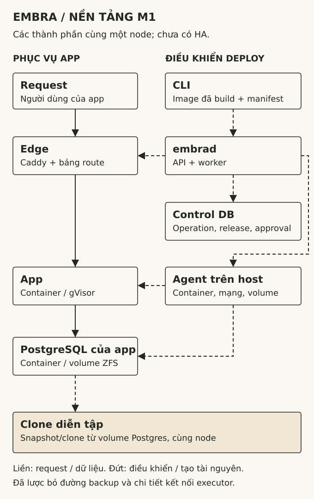
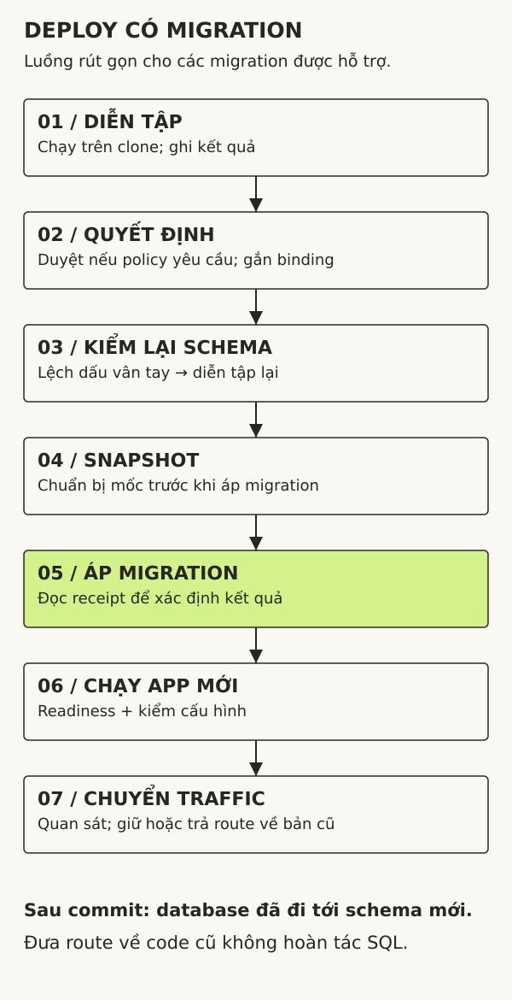

# Một lần deploy ở Embra đi qua những đâu?

*Embra Engineering · Xuất bản 09/10/2026 · Đối chiếu mã nguồn cùng ngày.*

Lấy một app quản lý đơn hàng làm ví dụ. Bản mới thêm cột `note` vào bảng `orders`, rồi đọc cột đó khi trả kết quả. File SQL chạy thành công. Container mới khởi động, nhưng không qua health check.

Lúc này, database đã đổi còn code cũ vẫn phục vụ. Chạy lại image cũ không xoá cột vừa thêm. Restore database về trước migration lại là một quyết định khác: những đơn hàng được ghi sau mốc phục hồi có thể bị bỏ lại.

Đó là tình huống kiến trúc deploy của Embra phải biểu diễn được. Một nhãn “deploy failed” chưa nói đủ chuyện gì đã xảy ra với app và dữ liệu.

Embra đang xây dựng hosting app và PostgreSQL cho developer và team nhỏ tại Việt Nam. Bài này đi qua nền tảng hiện có trong code, từ yêu cầu deploy đến lúc chuyển lưu lượng truy cập. Giao diện, build từ mã nguồn và MCP là hướng M2; website đang minh hoạ trải nghiệm đó. Sản phẩm chưa có bản phát hành công khai để bạn tự cài và thử toàn bộ luồng dưới đây.

## Request của người dùng đi một đường, lệnh deploy đi một đường

Khi app đang chạy, request đi qua edge tới container app. App kết nối PostgreSQL của môi trường triển khai đó. API điều khiển deploy không nằm trên đường đi của từng request.

Lệnh deploy được gửi tới `embrad`. Tiến trình này nhận yêu cầu và điều phối các tác vụ chạy nền qua worker. Một database riêng lưu trạng thái deploy, các release và quyết định duyệt; nó không chứa đơn hàng của app. Worker gửi lệnh cho agent trên máy chủ để tạo container, mạng và volume. Những thao tác cần quyền hệ thống nằm ở agent, còn API không chạy bằng root.

*Sơ đồ nền tảng M1, lược bỏ chi tiết mạng và backup. Các khối biểu diễn vai trò của từng thành phần. Hiện chúng cùng chạy trên một máy chủ. Mũi tên nét đứt chỉ lệnh điều khiển; nét liền chỉ đường request và dữ liệu. [Mở sơ đồ lớn](assets/architecture.svg).*

Edge lưu bảng route trên đĩa để đường phục vụ app không phải hỏi API điều khiển ở mỗi request. Tách hai đường này giúp giảm phụ thuộc khi quản lý deploy gặp lỗi. Tuy nhiên, các thành phần vẫn chung một miền sự cố: mất máy chủ có thể ảnh hưởng cả app, database lẫn phần điều khiển. Sơ đồ này chưa phải thiết kế HA nhiều máy.

## Chốt thứ sẽ chạy trước khi chạy nó

Đầu vào hiện tại là container image đã build, ghim bằng digest — mã định danh nội dung image. Bộ build từ mã nguồn sẽ được nối vào phía trước trong M2. Dùng digest ở nền tảng giúp kế hoạch deploy trỏ vào đúng bản image đã chọn, tránh việc tag như `latest` đổi nội dung sau khi người dùng đã xem kế hoạch.

Manifest mô tả image, cấu hình và các tham chiếu secret theo phiên bản. Khi có migration, nội dung các file cũng tham gia vào mã ràng buộc của kế hoạch, gọi là *binding*. Sau diễn tập, binding còn gắn với kết quả diễn tập được chọn.

Khi duyệt kế hoạch, người dùng gửi kèm binding ấy. Server kiểm mã này, thời hạn và phiên bản trạng thái của môi trường triển khai trước khi cho đi tiếp. Sửa migration hoặc dùng một kế hoạch đã cũ cần được xử lý như thay đổi thật, không được âm thầm chạy dưới một lần duyệt trước đó.

Đổi lại, đôi khi người dùng phải lập và duyệt lại kế hoạch. Bước bổ sung này giúp bảo đảm thứ đã duyệt vẫn là thứ sắp chạy.

## Thử migration trên bản sao, rồi kiểm lại trước khi áp

Bộ kiểm soát migration phân loại các file được hỗ trợ và chạy diễn tập trên một bản sao database. Nền tảng M1 dùng ZFS snapshot/clone trên cùng node, với mạng diễn tập riêng. Cách bố trí này khác với [lab backfill đã công bố](/engineering/backfill-8m/), vốn tạo clone từ replica. Không thể dùng kết quả của lab đó để mặc nhiên kết luận chi phí diễn tập trong M1.

Diễn tập ghi nhận thay đổi schema, lỗi và thời gian chạy. Nó có thể phát hiện một câu SQL không chạy được trên bản sao hiện tại. Nó chưa chứng minh mọi nhánh code của app tương thích với schema mới, cũng chưa bảo đảm latency khi production có truy vấn đồng thời. Clone cùng host vẫn chia sẻ tài nguyên vật lý.

Ngay trước khi áp migration, worker đối chiếu dấu vân tay schema hiện tại với schema đã diễn tập. Nếu lệch, kế hoạch bị huỷ để diễn tập lại. Qua bước đó, worker tạo snapshot trước migration rồi mới gọi executor.

*Luồng rút gọn cho migration được hỗ trợ. Bước duyệt phụ thuộc policy và kết quả diễn tập. Khi migration đã commit, một lỗi ở các bước app phía sau không làm database tự quay lại schema cũ.*

Nếu executor mất kết nối ngay quanh thời điểm commit, worker không thể chỉ nhìn lỗi mạng để biết SQL đã chạy hay chưa. Executor đọc dấu ghi nhận trong database đích để xác định kết quả. Với backfill theo lô, dữ liệu của lô và checkpoint được ghi trong cùng transaction. [Demo công khai](https://github.com/embra-labs/backfill-demo) tách riêng cơ chế này để bạn tự chạy ca ngắt trước và sau commit; nó không phải toàn bộ executor của sản phẩm.

## Chuyển yêu cầu sang app mới sau khi kiểm tra

Sau phần migration, worker tạo container của release mới, kiểm tra app đã sẵn sàng nhận yêu cầu chưa (readiness), rồi đối chiếu cấu hình chạy với cấu hình đã yêu cầu. Khi các bước đó qua, edge mới chuyển lưu lượng truy cập. Worker tiếp tục quan sát để quyết định giữ bản mới hay đưa route về bản cũ.

Quay lại ví dụ thêm `note`: nếu app mới không qua readiness, code cũ còn phục vụ nhưng schema đã có cột mới. Hệ thống ghi rõ trạng thái này trong kết quả deploy. Người vận hành cần biết database đã đi tới đâu trước khi chọn bước tiếp theo.

Điều đó cũng đặt ra trách nhiệm cho người viết app. Migration nên cho phép code cũ tiếp tục chạy trong giai đoạn chuyển tiếp. Nếu một bản mới muốn bỏ cột mà code cũ còn đọc, cần tách việc đổi code và xoá cột thành các lần deploy phù hợp. Bước kiểm tra readiness không bao quát hết mọi câu truy vấn nghiệp vụ.

## App và Postgres có ranh giới riêng, nhưng vẫn chung host

Mỗi môi trường triển khai có mạng riêng; app và PostgreSQL chạy trong các container riêng. App dùng gVisor (`runsc`), còn PostgreSQL dùng `runc` và volume trên ZFS. Agent áp dụng cấu hình mạng và giới hạn tài nguyên cho các thành phần này.

Lựa chọn runtime khác nhau cũng tạo thêm việc kiểm chứng. App cần được kiểm tra tính tương thích và phần tài nguyên cần thêm khi chạy dưới gVisor; PostgreSQL vẫn cần ranh giới quyền, mạng và storage của nó. Có container riêng không có nghĩa là mỗi app sở hữu một máy riêng hoặc hết ảnh hưởng từ tải của hàng xóm. Mức cô lập dưới tải phải được đo trên cấu hình cung cấp thực tế.

## Rollback code không tua lại đơn hàng

Rollback hiện tại dựng release từ manifest của bản đích. Nếu lịch sử có migration được áp bởi một deploy tạo sau release đích, API chặn rollback tự động. Cách xử lý này khá thận trọng: có migration vẫn tương thích với code cũ, nhưng hệ thống chưa có đủ bằng chứng để mặc định rằng quay lại sẽ ổn.

Restore database dùng một mốc dữ liệu khác. Với PITR, PostgreSQL phục hồi từ bản sao lưu nền (base backup) rồi phát lại WAL — nhật ký thay đổi — đến điểm đã chọn. Bản phục hồi không chứa các thay đổi sau điểm dừng ấy; [tài liệu PostgreSQL](https://www.postgresql.org/docs/18/continuous-archiving.html) mô tả cơ chế và yêu cầu lưu trữ WAL.

Snapshot trước migration giúp chuẩn bị một mốc quay lại trên storage hiện tại. Nó chưa đủ để xử lý mất cả host hoặc pool đĩa. Quy trình backup, phục hồi và kiểm tra dữ liệu sau phục hồi vẫn cần được kiểm riêng; nút restore trong giao diện minh hoạ không phải cam kết rằng mọi tình huống đó đã được giải quyết.

## Những gì còn phải chứng minh

Code hiện có đã nối các bước: nhận lệnh CLI, theo dõi deploy, diễn tập, áp dụng migration và chuyển yêu cầu sang bản mới. Báo cáo kiểm thử nội bộ có các kịch bản tích hợp trong VM dùng ZFS, containerd và gVisor. Đó là bằng chứng cho các kịch bản đã chạy, chưa phải kết quả vận hành trên workload khách hàng.

Một vướng mắc gần đây cho thấy khoảng cách ấy khá cụ thể. Trong bài thử nội bộ với bảng năm triệu dòng, diễn tập qua nhưng backfill thật gặp timeout ở từng lô với cấu hình mặc định. Tăng timeout trong một thí nghiệm giúp lượt đó hoàn tất; điều này chưa quyết định được quy tắc phù hợp cho sản phẩm. Nhận định này dựa trên báo cáo nội bộ ngày 09/10, chưa có bộ số liệu công khai để người đọc tái lập.

Phần M2 sẽ đưa build từ mã nguồn, giao diện và MCP vào luồng này. Các câu hỏi về timeout, ảnh hưởng lên app đang chạy và phục hồi vẫn phải được giải quyết ở nền tảng. Một giao diện dễ hiểu cần phản ánh đúng những trạng thái đó, nhất là khi code và database không cùng quay lại được một mốc.

Nếu đang chuẩn bị deploy app của mình, [guide deploy với Postgres](https://embra.cloud/engineering/deploy-with-postgres/) có các bước diễn tập và checklist để ghi kết quả.

Bạn có thể bắt đầu kiểm chứng từ [bài backfill tám triệu dòng](/engineering/backfill-8m/) và [demo checkpoint](https://github.com/embra-labs/backfill-demo). Để xem sản phẩm đang ở đâu và phạm vi dùng thử, đọc [tiến độ Embra](/#trang-thai).
